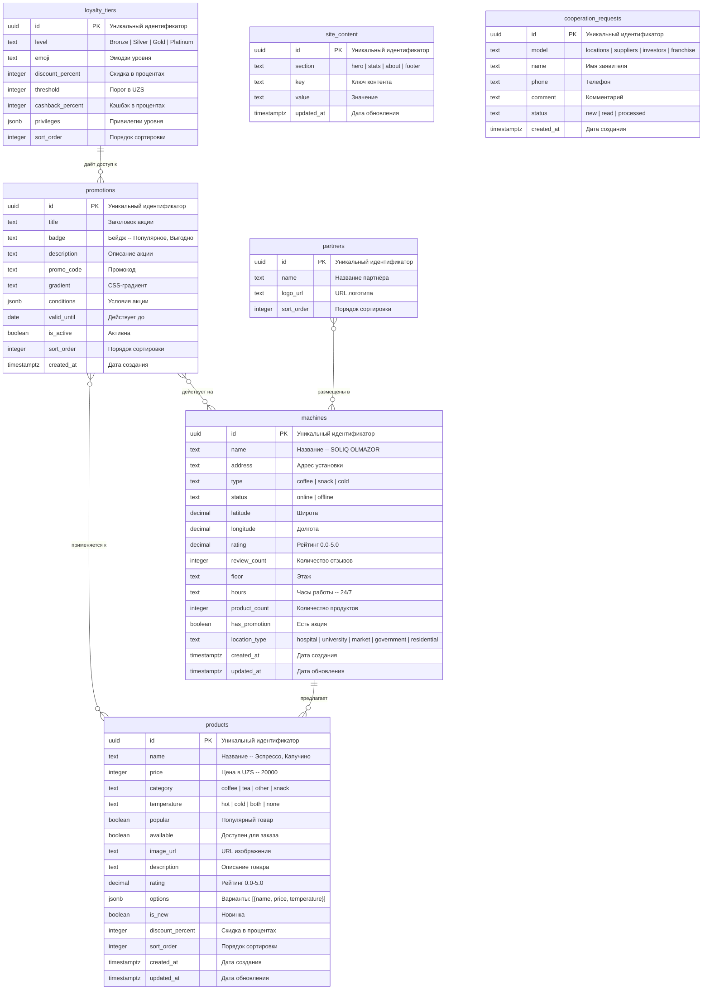

# VendHub.uz -- ER-диаграмма базы данных

> Схема базы данных Supabase для проекта VendHub.uz -- платформы вендинговых автоматов в Узбекистане.

## ER-диаграмма



## Описание таблиц

### `products` -- Каталог продуктов

Хранит все товары, доступные в вендинговых автоматах: кофе, чай, снеки и другие напитки. Поле `options` (JSONB) содержит встроенный массив вариантов продукта (размер, добавки), каждый со своими `name`, `price` и `temperature`. Это позволяет избежать отдельной таблицы для вариантов.

| Поле | Тип | Описание |
|------|-----|----------|
| `id` | uuid, PK | Уникальный идентификатор |
| `name` | text, NOT NULL | Название продукта |
| `price` | integer, NOT NULL | Цена в UZS |
| `category` | text, NOT NULL | Категория: `coffee`, `tea`, `other`, `snack` |
| `temperature` | text, NOT NULL | Температура: `hot`, `cold`, `both`, `none` |
| `popular` | boolean | Флаг популярности (default: false) |
| `available` | boolean | Доступность (default: true) |
| `image_url` | text | URL изображения |
| `description` | text | Описание |
| `rating` | decimal(2,1) | Рейтинг (default: 0) |
| `options` | jsonb | Массив вариантов `[{name, price, temperature}]` |
| `is_new` | boolean | Флаг новинки (default: false) |
| `discount_percent` | integer | Процент скидки |
| `sort_order` | integer | Порядок сортировки (default: 0) |
| `created_at` | timestamptz | Дата создания |
| `updated_at` | timestamptz | Дата обновления |

### `machines` -- Вендинговые автоматы

Реестр всех автоматов VendHub с координатами, статусом и характеристиками. Поле `location_type` помогает фильтровать автоматы по типу локации на карте.

| Поле | Тип | Описание |
|------|-----|----------|
| `id` | uuid, PK | Уникальный идентификатор |
| `name` | text, NOT NULL | Название точки |
| `address` | text, NOT NULL | Адрес |
| `type` | text, NOT NULL | Тип автомата: `coffee`, `snack`, `cold` |
| `status` | text | Статус: `online`, `offline` (default: `online`) |
| `latitude` | decimal(10,7) | Широта |
| `longitude` | decimal(10,7) | Долгота |
| `rating` | decimal(2,1) | Рейтинг (default: 0) |
| `review_count` | integer | Количество отзывов (default: 0) |
| `floor` | text | Этаж |
| `hours` | text | Часы работы (default: `24/7`) |
| `product_count` | integer | Количество продуктов (default: 0) |
| `has_promotion` | boolean | Есть акция (default: false) |
| `location_type` | text | Тип локации: `hospital`, `university`, `market`, `government`, `residential` |
| `created_at` | timestamptz | Дата создания |
| `updated_at` | timestamptz | Дата обновления |

### `promotions` -- Акции и спецпредложения

Промо-акции, отображаемые на сайте. Поле `conditions` (JSONB) хранит произвольные условия акции. Поле `gradient` задаёт CSS-класс для визуального оформления карточки.

| Поле | Тип | Описание |
|------|-----|----------|
| `id` | uuid, PK | Уникальный идентификатор |
| `title` | text, NOT NULL | Заголовок |
| `badge` | text, NOT NULL | Бейдж (напр. "Популярное", "Выгодно") |
| `description` | text | Описание |
| `promo_code` | text | Промокод |
| `gradient` | text | CSS-градиент для карточки |
| `conditions` | jsonb | Условия акции (default: `[]`) |
| `valid_until` | date | Дата окончания |
| `is_active` | boolean | Активна (default: true) |
| `sort_order` | integer | Порядок сортировки (default: 0) |
| `created_at` | timestamptz | Дата создания |

### `loyalty_tiers` -- Уровни лояльности

Определяет уровни программы лояльности VendHub. Поле `privileges` (JSONB) хранит произвольные привилегии каждого уровня.

| Поле | Тип | Описание |
|------|-----|----------|
| `id` | uuid, PK | Уникальный идентификатор |
| `level` | text, NOT NULL | Уровень: `Bronze`, `Silver`, `Gold`, `Platinum` |
| `emoji` | text | Эмодзи уровня |
| `discount_percent` | integer | Скидка в % |
| `threshold` | integer | Порог накоплений в UZS |
| `cashback_percent` | integer | Кэшбэк в % |
| `privileges` | jsonb | Привилегии (default: `{}`) |
| `sort_order` | integer | Порядок сортировки (default: 0) |

### `site_content` -- Контент сайта

Динамический контент для различных секций лендинга. Позволяет редактировать тексты сайта через админ-панель без деплоя.

| Поле | Тип | Описание |
|------|-----|----------|
| `id` | uuid, PK | Уникальный идентификатор |
| `section` | text, NOT NULL | Секция: `hero`, `stats`, `about`, `footer` |
| `key` | text, NOT NULL | Ключ |
| `value` | text, NOT NULL | Значение |
| `updated_at` | timestamptz | Дата обновления |

### `cooperation_requests` -- Заявки на сотрудничество

Заявки от потенциальных партнёров, поступающие через форму на сайте.

| Поле | Тип | Описание |
|------|-----|----------|
| `id` | uuid, PK | Уникальный идентификатор |
| `model` | text, NOT NULL | Модель: `locations`, `suppliers`, `investors`, `franchise` |
| `name` | text, NOT NULL | Имя заявителя |
| `phone` | text, NOT NULL | Телефон |
| `comment` | text | Комментарий |
| `status` | text | Статус: `new`, `read`, `processed` (default: `new`) |
| `created_at` | timestamptz | Дата создания |

### `partners` -- Партнёры

Логотипы и названия партнёров для отображения на сайте.

| Поле | Тип | Описание |
|------|-----|----------|
| `id` | uuid, PK | Уникальный идентификатор |
| `name` | text, NOT NULL | Название |
| `logo_url` | text | URL логотипа |
| `sort_order` | integer | Порядок сортировки (default: 0) |

## Связи между таблицами

База данных использует **плоскую структуру без внешних ключей** (FK), что типично для Supabase-проектов с RLS. Связи между сущностями реализуются на уровне приложения:

| Связь | Описание |
|-------|----------|
| `machines` -> `products` | Автоматы предлагают продукты. Связь определяется по `machines.type` и `products.category` на уровне приложения |
| `promotions` -> `products` | Акции могут применяться к конкретным продуктам. Связь через `promotions.conditions` (JSONB) |
| `promotions` -> `machines` | Акции могут действовать на конкретных автоматах. Флаг `machines.has_promotion` |
| `loyalty_tiers` -> `promotions` | Уровни лояльности дают доступ к эксклюзивным акциям |
| `products.options` | Встроенные варианты продукта (JSONB), заменяют отдельную таблицу `product_options` |
| `site_content` | Универсальный key-value для контента, может ссылаться на любые сущности через `key` |

## RLS (Row Level Security) политики

Supabase использует Row Level Security для контроля доступа к данным на уровне базы данных.

### Рекомендуемые политики

```sql
-- =============================================
-- products: публичное чтение, запись для admin
-- =============================================
ALTER TABLE products ENABLE ROW LEVEL SECURITY;

CREATE POLICY "Products: публичное чтение"
    ON products FOR SELECT
    USING (true);

CREATE POLICY "Products: запись для admin"
    ON products FOR ALL
    USING (auth.role() = 'service_role');

-- =============================================
-- machines: публичное чтение, запись для admin
-- =============================================
ALTER TABLE machines ENABLE ROW LEVEL SECURITY;

CREATE POLICY "Machines: публичное чтение"
    ON machines FOR SELECT
    USING (true);

CREATE POLICY "Machines: запись для admin"
    ON machines FOR ALL
    USING (auth.role() = 'service_role');

-- =============================================
-- promotions: публичное чтение активных, запись для admin
-- =============================================
ALTER TABLE promotions ENABLE ROW LEVEL SECURITY;

CREATE POLICY "Promotions: публичное чтение активных"
    ON promotions FOR SELECT
    USING (is_active = true);

CREATE POLICY "Promotions: запись для admin"
    ON promotions FOR ALL
    USING (auth.role() = 'service_role');

-- =============================================
-- loyalty_tiers: публичное чтение
-- =============================================
ALTER TABLE loyalty_tiers ENABLE ROW LEVEL SECURITY;

CREATE POLICY "Loyalty tiers: публичное чтение"
    ON loyalty_tiers FOR SELECT
    USING (true);

CREATE POLICY "Loyalty tiers: запись для admin"
    ON loyalty_tiers FOR ALL
    USING (auth.role() = 'service_role');

-- =============================================
-- site_content: публичное чтение, запись для admin
-- =============================================
ALTER TABLE site_content ENABLE ROW LEVEL SECURITY;

CREATE POLICY "Site content: публичное чтение"
    ON site_content FOR SELECT
    USING (true);

CREATE POLICY "Site content: запись для admin"
    ON site_content FOR ALL
    USING (auth.role() = 'service_role');

-- =============================================
-- cooperation_requests: публичная вставка, чтение для admin
-- =============================================
ALTER TABLE cooperation_requests ENABLE ROW LEVEL SECURITY;

CREATE POLICY "Cooperation requests: публичная вставка"
    ON cooperation_requests FOR INSERT
    WITH CHECK (true);

CREATE POLICY "Cooperation requests: чтение для admin"
    ON cooperation_requests FOR SELECT
    USING (auth.role() = 'service_role');

CREATE POLICY "Cooperation requests: обновление для admin"
    ON cooperation_requests FOR UPDATE
    USING (auth.role() = 'service_role');

-- =============================================
-- partners: публичное чтение
-- =============================================
ALTER TABLE partners ENABLE ROW LEVEL SECURITY;

CREATE POLICY "Partners: публичное чтение"
    ON partners FOR SELECT
    USING (true);

CREATE POLICY "Partners: запись для admin"
    ON partners FOR ALL
    USING (auth.role() = 'service_role');
```

### Принципы RLS

| Таблица | SELECT | INSERT | UPDATE | DELETE |
|---------|--------|--------|--------|--------|
| `products` | Все | Admin | Admin | Admin |
| `machines` | Все | Admin | Admin | Admin |
| `promotions` | Все (is_active) | Admin | Admin | Admin |
| `loyalty_tiers` | Все | Admin | Admin | Admin |
| `site_content` | Все | Admin | Admin | Admin |
| `cooperation_requests` | Admin | Все | Admin | -- |
| `partners` | Все | Admin | Admin | Admin |

> **Admin** = `service_role` (серверный ключ Supabase, используется в API-роутах Next.js).
> Публичные запросы идут через `anon` ключ с ограничениями RLS.

---

*Документ сгенерирован для проекта VendHub.uz. Актуальная схема может отличаться -- сверяйтесь с Supabase Dashboard.*
