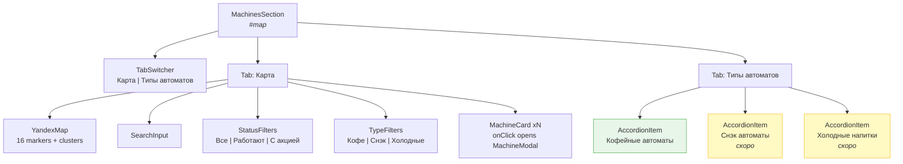
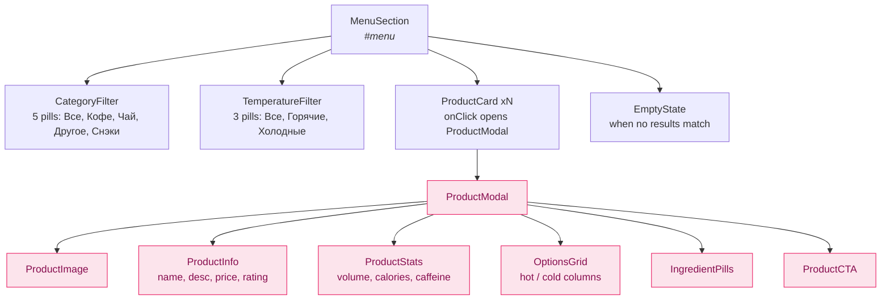
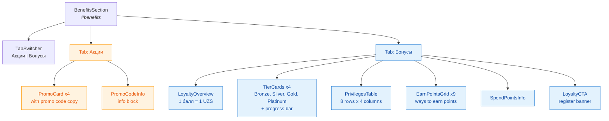
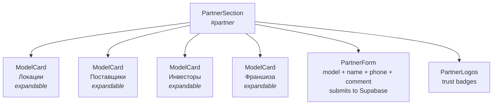
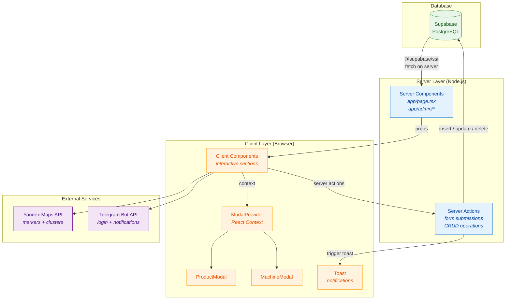

# VendHub.uz -- Component Tree

> React component architecture for the VendHub.uz website.
> Next.js 16 / App Router / React 19 / Supabase / Tailwind CSS 4

---

## 1. Landing Page -- Component Tree

The landing page (`app/page.tsx`) is a single-page layout with 6 scrollable sections anchored by hash links (`#home`, `#map`, `#menu`, `#benefits`, `#partner`, `#about`).

```mermaid
graph TD
    ROOT["RootLayout<br/><i>app/layout.tsx</i><br/>Playfair Display + DM Sans<br/>bg-cream text-chocolate"]
    ROOT --> HOME["Home<br/><i>app/page.tsx</i><br/>Server Component"]

    HOME --> HEADER["Header"]
    HOME --> HERO["HeroSection<br/><i>#home</i>"]
    HOME --> STATS["StatsSection"]
    HOME --> QUICK["QuickActions"]
    HOME --> POPULAR["PopularProducts"]
    HOME --> PROMO["PromoBanner"]
    HOME --> WHY["WhyVendHub"]
    HOME --> MAP["MachinesSection<br/><i>#map</i>"]
    HOME --> MENU["MenuSection<br/><i>#menu</i>"]
    HOME --> BENEFITS["BenefitsSection<br/><i>#benefits</i>"]
    HOME --> PARTNER["PartnerSection<br/><i>#partner</i>"]
    HOME --> ABOUT["AboutSection<br/><i>#about</i>"]
    HOME --> FOOTER["Footer"]
    HOME --> MODALS["Modals<br/><i>ModalProvider context</i>"]

    %% Header
    HEADER --> LOGO["Logo<br/>VendHub + Coffee & Snacks"]
    HEADER --> NAV["NavLinks<br/>6 items, smooth scroll"]
    HEADER --> LOGIN["LoginButton<br/>btn-caramel, opens Telegram"]
    HEADER --> MOBILE["MobileMenu<br/>burger, dropdown overlay"]

    %% Hero
    HERO --> GREET["DynamicGreeting<br/>time-based"]
    HERO --> HTITLE["HeroTitle<br/>Playfair Display"]
    HERO --> HSUB["HeroSubtitle<br/>dynamic numbers"]
    HERO --> CTA["CTAButtons<br/>Найти автомат + Смотреть меню"]
    HERO --> HIMG["MachineImage<br/>desktop only"]

    %% Stats
    STATS --> SC1["StatCard<br/>автоматов"]
    STATS --> SC2["StatCard<br/>напитков"]
    STATS --> SC3["StatCard<br/>заказов"]
    STATS --> SC4["StatCard<br/>рейтинг"]

    %% Quick Actions
    QUICK --> QA1["ActionCard<br/>Каталог"]
    QUICK --> QA2["ActionCard<br/>Автоматы"]

    %% Popular Products
    POPULAR --> PC["ProductCard x4<br/>onClick opens ProductModal"]

    %% Why VendHub
    WHY --> RC["ReasonCard x4"]

    %% Modals
    MODALS --> PMOD["ProductModal"]
    MODALS --> MMOD["MachineModal"]

    classDef server fill:#E8F5E9,stroke:#4CAF50,color:#1B5E20
    classDef client fill:#FFF3E0,stroke:#FF9800,color:#E65100
    classDef section fill:#EFEBE9,stroke:#5D4037,color:#3E2723
    classDef modal fill:#FCE4EC,stroke:#E91E63,color:#880E4F

    class ROOT,HOME server
    class HEADER,HERO,STATS,QUICK,POPULAR,PROMO,WHY,MAP,MENU,BENEFITS,PARTNER,ABOUT,FOOTER section
    class GREET,NAV,MOBILE,CTA,PC,MODALS client
    class PMOD,MMOD modal
```



---

## 2. Machines Section -- Detailed Breakdown

The `#map` section uses a tab switcher to toggle between map view and machine types.



---

## 3. Menu Section -- Detailed Breakdown



---

## 4. Benefits Section -- Detailed Breakdown



---

## 5. Partner Section -- Detailed Breakdown



---

## 6. Admin Panel -- Component Tree

All admin pages are protected by an auth guard in `AdminLayout`. The sidebar provides navigation across 8 sections.

```mermaid
graph TD
    ADMIN["AdminLayout<br/><i>app/admin/layout.tsx</i><br/>auth guard via Supabase session"]

    ADMIN --> ASIDE["AdminSidebar<br/>8 nav items"]
    ADMIN --> AHEADER["AdminHeader<br/>user email + logout"]
    ADMIN --> CONTENT["Page Content<br/><i>dynamic slot</i>"]

    CONTENT --> DASH["Dashboard<br/><i>app/admin/page.tsx</i>"]
    CONTENT --> PROD["Products<br/><i>app/admin/products/page.tsx</i>"]
    CONTENT --> MACH["Machines<br/><i>app/admin/machines/page.tsx</i>"]
    CONTENT --> PROMOS["Promotions<br/><i>app/admin/promotions/page.tsx</i>"]
    CONTENT --> LOY["Loyalty<br/><i>app/admin/loyalty/page.tsx</i>"]
    CONTENT --> CMS["Content<br/><i>app/admin/content/page.tsx</i>"]
    CONTENT --> COOP["Cooperation<br/><i>app/admin/cooperation/page.tsx</i>"]
    CONTENT --> PARTNERS["Partners<br/><i>app/admin/partners/page.tsx</i>"]

    DASH --> DSC["StatCards<br/>summary metrics"]
    DASH --> DQL["QuickLinks<br/>jump to sections"]

    PROD --> PTB["ProductTable<br/>sortable, filterable"]
    PROD --> PF["ProductForm<br/>modal, CRUD"]

    MACH --> MTB["MachineTable<br/>sortable"]
    MACH --> MF["MachineForm<br/>modal, CRUD"]

    PROMOS --> PRTB["PromotionTable"]
    PROMOS --> PRF["PromotionForm"]

    LOY --> TE["TierEditor<br/>4 rows inline edit"]

    CMS --> CE["ContentEditor<br/>key-value pairs by section"]

    COOP --> RTB["RequestsTable"]
    COOP --> SB["StatusBadge"]

    PARTNERS --> PATB["PartnersTable"]
    PARTNERS --> PAF["PartnerForm"]

    ADMIN --> ALOGIN["Login<br/><i>app/admin/login/page.tsx</i><br/>standalone, no sidebar"]

    classDef layout fill:#E8EAF6,stroke:#3F51B5,color:#1A237E
    classDef page fill:#EFEBE9,stroke:#5D4037,color:#3E2723
    classDef sub fill:#FFF3E0,stroke:#FF9800,color:#E65100
    classDef auth fill:#FFEBEE,stroke:#F44336,color:#B71C1C

    class ADMIN,ASIDE,AHEADER layout
    class DASH,PROD,MACH,PROMOS,LOY,CMS,COOP,PARTNERS page
    class DSC,DQL,PTB,PF,MTB,MF,PRTB,PRF,TE,CE,RTB,SB,PATB,PAF sub
    class ALOGIN auth
```



---

## 7. Data Flow



---

## 8. Shared UI Components

All reusable primitives live in `components/ui/`. They follow the coffee-themed design system defined in `tailwind.config.ts`.

| Component | Purpose | Variants / Notes |
|---|---|---|
| **Button** | Primary action element | `espresso`, `caramel`, `outline`, `ghost` |
| **Card** | Content container | `coffee-card` base class, optional `hover-lift` |
| **Pill** | Filter / tag toggle | active/inactive states, optional count badge |
| **Modal** | Overlay dialog | overlay + slideUp animation, close on ESC / overlay click |
| **Badge** | Status / label indicator | `promo`, `new`, `unavailable`, `status` |
| **PriceTag** | Currency display | Formatted UZS, optional strikethrough for discounts |
| **SectionHeader** | Section title block | Title: Playfair Display, Subtitle: DM Sans |
| **Toast** | Notification popup | `success`, `error`, `info` -- bounceIn animation |
| **Input** | Text input field | Label, error state, leading icon |
| **Select** | Dropdown selector | Standard dropdown |
| **Textarea** | Multi-line input | Label support |
| **Table** | Data table (admin) | Sortable columns, actions column |

---

## 9. State Management

The project deliberately keeps state management minimal, relying on React Server Components for data and React Context for UI state.

### Server-side (data)

- **Supabase SSR client** (`@supabase/ssr`) is used inside Server Components to fetch data at request time.
- Admin pages use Server Actions for mutations (create, update, delete).
- No client-side data cache -- each navigation re-fetches from Supabase.

### Client-side (UI state)

| Context / State | Scope | Purpose |
|---|---|---|
| **ModalProvider** | Global (wraps landing page) | Controls which modal is open and passes data to `ProductModal` / `MachineModal` |
| **useState (local)** | Per-component | Filter selections (category, temperature, status, type), tab state, accordion open/close, mobile menu toggle |
| **useEffect (local)** | HeroSection | Time-based greeting (morning / afternoon / evening) |
| **Form state** | PartnerForm, Admin forms | Controlled inputs, validation errors, submission state |

### No external state library

The architecture does not use Redux, Zustand, or Jotai. React 19's built-in primitives (`use`, `useFormStatus`, `useOptimistic`) plus Server Components cover all requirements.

---

## 10. Design Tokens Reference

The color palette and typography from `tailwind.config.ts`:

```
Colors:
  cream       #FDF8F3   -- page background
  espresso    #5D4037   -- primary brand (buttons, headings)
  espresso-light  #795548
  espresso-dark   #3E2723
  espresso-50     #EFEBE9
  caramel     #D4A574   -- accent (CTA, highlights)
  caramel-light   #E8C9A8
  caramel-dark    #B8834A
  chocolate   #2C1810   -- body text
  mint        #7CB69D   -- success, availability
  mint-light  #E8F5E9
  foam        #F5F0EB   -- subtle background

Fonts:
  display     Playfair Display (serif)  -- headings
  body        DM Sans (sans-serif)      -- everything else

Animations:
  fadeUp      0.6s   -- section entrance
  fadeIn      0.4s   -- general fade
  slideUp     0.3s   -- modal entrance
  expand      0.3s   -- accordion open
  bounceIn    0.4s   -- toast popup
```

---

## 11. File Structure (target)

```
vendhub-site/
├── app/
│   ├── layout.tsx                 # RootLayout (fonts, meta, body)
│   ├── page.tsx                   # Landing page (Server Component)
│   ├── globals.css                # Tailwind directives + custom
│   └── admin/
│       ├── layout.tsx             # AdminLayout (auth guard + sidebar)
│       ├── login/page.tsx         # Login page (standalone)
│       ├── page.tsx               # Dashboard
│       ├── products/page.tsx      # Products CRUD
│       ├── machines/page.tsx      # Machines CRUD
│       ├── promotions/page.tsx    # Promotions CRUD
│       ├── loyalty/page.tsx       # Loyalty tiers editor
│       ├── content/page.tsx       # CMS content editor
│       ├── cooperation/page.tsx   # Partnership requests
│       └── partners/page.tsx      # Partners management
├── components/
│   ├── landing/
│   │   ├── Header.tsx
│   │   ├── HeroSection.tsx
│   │   ├── StatsSection.tsx
│   │   ├── QuickActions.tsx
│   │   ├── PopularProducts.tsx
│   │   ├── PromoBanner.tsx
│   │   ├── WhyVendHub.tsx
│   │   ├── MachinesSection.tsx
│   │   ├── MenuSection.tsx
│   │   ├── BenefitsSection.tsx
│   │   ├── PartnerSection.tsx
│   │   ├── AboutSection.tsx
│   │   └── Footer.tsx
│   ├── modals/
│   │   ├── ModalProvider.tsx
│   │   ├── ProductModal.tsx
│   │   └── MachineModal.tsx
│   ├── admin/
│   │   ├── AdminSidebar.tsx
│   │   ├── AdminHeader.tsx
│   │   ├── ProductTable.tsx
│   │   ├── ProductForm.tsx
│   │   ├── MachineTable.tsx
│   │   ├── MachineForm.tsx
│   │   ├── PromotionTable.tsx
│   │   ├── PromotionForm.tsx
│   │   ├── TierEditor.tsx
│   │   ├── ContentEditor.tsx
│   │   ├── RequestsTable.tsx
│   │   ├── PartnersTable.tsx
│   │   └── PartnerForm.tsx
│   └── ui/
│       ├── Button.tsx
│       ├── Card.tsx
│       ├── Pill.tsx
│       ├── Modal.tsx
│       ├── Badge.tsx
│       ├── PriceTag.tsx
│       ├── SectionHeader.tsx
│       ├── Toast.tsx
│       ├── Input.tsx
│       ├── Select.tsx
│       ├── Textarea.tsx
│       └── Table.tsx
├── lib/
│   ├── supabase/
│   │   ├── client.ts              # Browser Supabase client
│   │   ├── server.ts              # Server Supabase client
│   │   └── middleware.ts           # Auth session refresh
│   └── utils.ts                   # Formatters, helpers
├── public/
│   ├── images/
│   └── icons/
├── tailwind.config.ts
├── next.config.ts
└── package.json
```

---

*Last updated: 2026-02-23*
